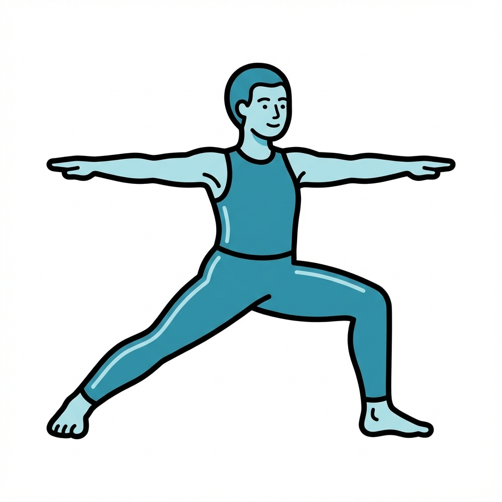
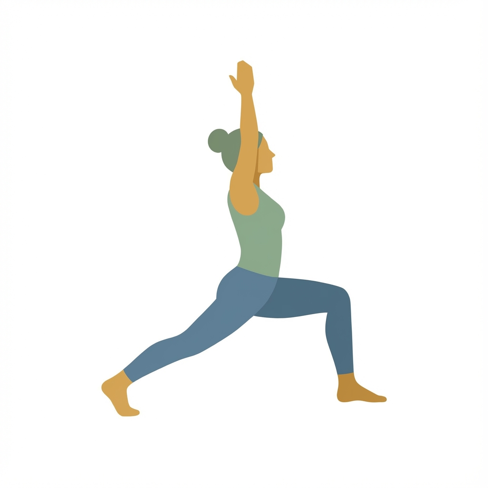

# 🧘‍♀️ Smart Yoga Pose Corrector

> **Your AI-Powered Personal Yoga Instructor**


**Smart Yoga** is a cutting-edge Android application that uses on-device Machine Learning to correct your yoga form in real-time. Built with **MediaPipe** and **Jetpack Compose**, it acts as a smart mirror, guiding you through sessions, counting your hold times, and tracking your progress.

---

## ✨ Features

### 🤖 Real-Time AI Feedback
No more guessing! The app uses computer vision to analyze your body landmarks 30 times a second.
- **Green Lines**: Perfect form! ✅
- **Red Lines**: Adjust your position! ❌

### ⏱️ Smart Timer
The timer **only** counts down when you are holding the pose correctly. If you wobble or break form, the timer pauses. It pushes you to hold the *perfect* pose for the full duration.

### 🧘 Session Mode
Guided flow through essential yoga poses:
1.  **Warrior II** - Build strength and stability.
2.  **Tree Pose** - Master your balance.
3.  **Warrior I** - Open your hips and chest.
4.  **Down Dog** - Rejuvenate and stretch.
5.  **Cobra** - Strengthen your back.

### 📊 Progress Tracking
Track your daily consistency and total sessions. Watch your yoga journey unfold!

### 🎨 Immersive Experience
- **Tropic Mode**: Switch to a calming tropical gradient background.
- **Zen Music**: Integrated music player for focus (add your own tracks!).
- **Privacy First**: All processing happens **on-device**. No video is ever sent to the cloud.

---

## 📸 Poses Supported

| Warrior II | Tree Pose | Warrior I |
| :---: | :---: | :---: |
|  |  |  |

---

## 🛠️ Tech Stack

- **Language**: Kotlin
- **UI Framework**: Jetpack Compose
- **ML Engine**: Google MediaPipe (Pose Landmarker)
- **Camera**: CameraX
- **Architecture**: MVVM (Model-View-ViewModel)

## 🚀 Getting Started

1.  **Clone the repo**:
    ```bash
    git clone https://github.com/yourusername/smart-yoga.git
    ```
2.  **Open in Android Studio**.
3.  **Run on a Physical Device** (Camera required).
4.  **Grant Permissions** and start your flow!

---

*Built with ❤️ and 🤖 by Antigravity*
